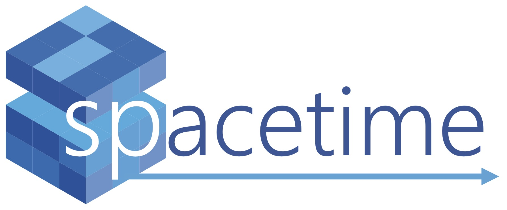

## Description:
Here I document the use and progress of the spacetime python library with a series of notebooks. These range from describing suported data type to trimming data layers, creating cubes and opperating on cleaned data.

## Documentation: 
* [API](documents/api.md)
* [PyPI Page Draft](documents/description.md)
* [Spacetime Walkthrough Notebook](spaceTime_vignettes/spacetime_walkthrough.html)
* [Python Dependancies](documents/requires.txt)
* [Github Repository](https://github.com/alexburn17/spacetime_demo)

## Using Spacetime in Kaggle:
Kaggle is an online virtual computing environment. I have installed python and spacetime's dependancies in a virtual environment. Data can be uploaded, operated on using spacetime functions in a notebook. The outputs can be downloaded of off the VM. This allows the user to explore spacetime on their own datasets without installing python on their local machine. This is the simplest way to use spacetime at the moment. Instructions are below.

* [Click to use Spacetime through Kaggle](spacetimeKaggle.md)

## Using Spacetime in R Studio:
Spacetime is currently a python library but can be accessed in the R Studio environment using the reticulate package. This will allow the user to switch back and forth between Python and R in a R Markdown file. The following link gives installation instructions.

* [Click to use Spacetime through R Studio](pythonViaR.md)

## Spacetime Vignettes:
When using vignettes, simply copy spacetime commands directly into your own driver. (Note: vignettes will continue to grow and more will be added.)

* [Loading Files and Making Cubes](spaceTime_vignettes/readingFiles.html)
* [Spatial Scaling](spaceTime_vignettes/scaling.html)
* [Temporal Scaling](spaceTime_vignettes/scalingTime.html)
* [Writing and Reading Cubes](spaceTime_vignettes/readAndWrite.html)
* [Cube Operations](spaceTime_vignettes/cubeOps.html)
* [Plotting Cubes](spaceTime_vignettes/plotting.html)
	* [Plotting Video Demo](https://youtu.be/qOAcEe4S32g) 	

## All Team Meeting (August 2022):
Files and a videos for the material presented by Theme 3 for the August 2022 all teams meeting.

**Presentation:**

* [Theme Three Presentation Video](https://www.youtube.com/watch?v=RIKNoj4rkmE)
* [Theme 3 Slides](documents/All_Team_Theme3.pptx)

**Demonstration:**

* [Theme Three Spacetime Demo Video](https://www.youtube.com/watch?v=6yP55cXeoN4)
* [All Teams Meeting Demonstration](spaceTime_vignettes/AllTeams_Demo.html)
* [All Teams Meeting Script](templates/AllTeams_Demo.Rmd)

