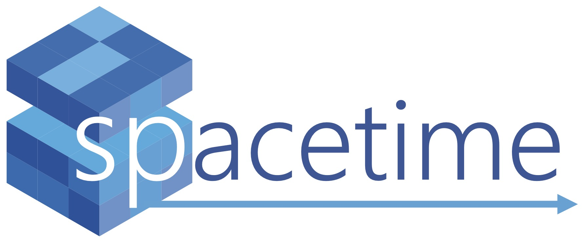
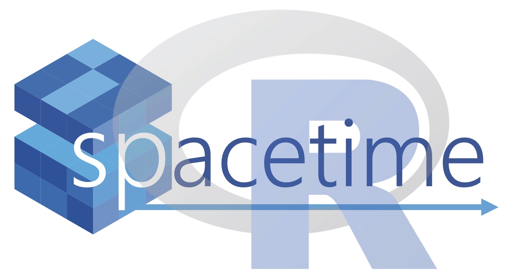
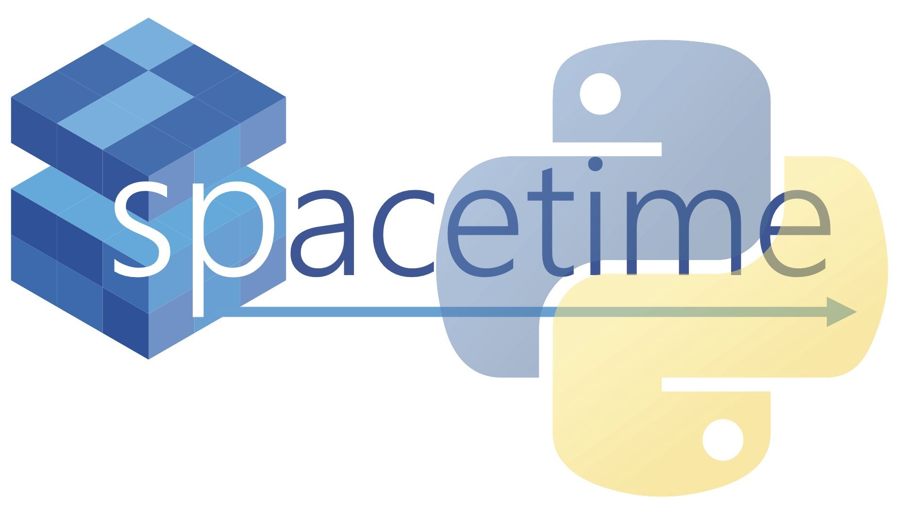

# Description:

***
The main objective of the spacetime package is to make tasks like loading, rescaling, merging, and conducting mathmatical operations on spatiotemporal (or other D-dimensional data sets) easier for the user by providing a set of concise yet powerful functions. Spacetime opperations utilize a cube-like structure for all data sets that makes storing and manipulating large D-dimensional datasets more efficient. For scientists working with spatiotemporal data (such as climate or weather data sets) spacetime is an ideal platform that allows the user to focus on the science rather than the coding. Spacetime is in the beta stage (version number = 0.0.1) as a R package and a Python code base. A full Python library will be available on PyPI soon! Additional functionality will be added on a regular basis. The current functionality of spacetime is below:


*Spacetime is a product of [Barracuda](https://biobarracuda.org/), a collaboration between the University of Vermont and the University of Maine. Barracuda's mission is to harness diverse current and historic data and new mechanistic models across the continental United States to help us better predict and adapt to climate change impacts on biodiversity and rural communities. This project is open source and funded by a National Science Foundation EPSCoR grant*


## Spacetime - The R Package 




Spacetime is currently available as a package in R. It is in it's beta version (v0.0.1) and can be installed through github via dev tools. Instructions and documentation are below.


### Documentation: 
* [Spacetime API - R](api-r.md)
* [Spacetime Installation and Walkthrough Notebook](spaceTime_vignettes/spacetimeDoc.html)
	* [R Markdown file](templates/spacetimeDoc.Rmd)
* [Github Repository](https://github.com/alexburn17/spacetime_r)
* [KNOWN ISSUES! (10 JULY 2023)](known_issues_R.md)

### Installing Spacetime:
Spacetime is a package built in python that makes cleaning spatiotemporal datasets a much simpler task than it has been previously. Because it is built in python, a python installtion is required. To install spacetime from github, first install miniconda using the reticulate package. This only needs to be completed once before the first installation. Subsequent updates do not require this step.

```r
library(reticulate)

install_miniconda(path = miniconda_path(), force = TRUE)
```


Now that we have a miniconda environment to work from, we can proceed with installing spacetime.

```r

library(devtools)

install_github("alexburn17/spacetime_R") # install spacetime

library(spacetime) # load the package

```

### Citing Spacetime for R:

Please use the following citation when publishing works that use spacetime:

*P.A. Burnham, M. Dube, Q. Dubois, N.J. Gotelli, and B.J. McGill (2023). spacetime: A package for cleaning and analyzing spatiotemporal data in
R. R package version 0.0.1. [https://github.com/alexburn17/spacetime_r](https://github.com/alexburn17/spacetime_r)*

* [BibTeX Citation for LaTeX Users](documents/spacetime_bibtex.txt)

## Spacetime - The Python Library 


  Installing Spacetime Python


Spacetime is also available as a Python library. It is currently on Test PyPI and can be installed with pip. Information on installation and the package's api are below.

### Documentation: 
* [Spacetime PyPI Page](https://test.pypi.org/project/spacetimepy/)
* [Spacetime API - Python](api.md)
* [PyPI Page Draft](description.md)
* [Spacetime Walkthrough Notebook](spaceTime_vignettes/spacetime_walkthrough.html)
	* [Python Walkthrough Script](templates/spacetime_walkthrough.py) 
	* [R Markdown Script](templates/spacetime_walkthrough.Rmd)
* [Python Dependancies](documents/requires.txt)
* [Github Repository](https://github.com/alexburn17/spacetime_python)

### Installing Spacetime for Python

In you bash window, install spacetimepy with pip.

```bash
pip install -i https://test.pypi.org/simple/ spacetimepy
```

In your python script, load spacetimepy in the following manner.


```python
import spacetimepy as sp
```


### Spacetime Python Vignettes:
When using vignettes, simply copy spacetime commands directly into your own driver. (Note: vignettes will continue to grow and more will be added.)

* [Loading Files and Making Cubes](spaceTime_vignettes/readingFiles.html)
* [Spatial Scaling](spaceTime_vignettes/scaling.html)
* [Temporal Scaling](spaceTime_vignettes/scalingTime.html)
* [Writing and Reading Cubes](spaceTime_vignettes/readAndWrite.html)
* [Cube Operations](spaceTime_vignettes/cubeOps.html)
* [Plotting Cubes](spaceTime_vignettes/plotting.html)
	* [Plotting Video Demo](https://youtu.be/qOAcEe4S32g) 


### Citing Spacetime for Python:

Please use the following citation when publishing works that use spacetime:

*P.A. Burnham, M. Dube, Q. Dubois, N.J. Gotelli, and B.J. McGill (2023). spacetime: A library for cleaning and analyzing spatiotemporal data in
Python. Python version 0.1.5. [https://github.com/alexburn17/spacetime_r](https://github.com/alexburn17/spacetime_python)*

* [BibTeX Citation for LaTeX Users](documents/spacetime_bibtex_py.txt)


## Spacetime Archived Content:


* [Click to use Spacetime through Kaggle](spacetimeKaggle.md)
* [Spacetime as a Python Library in R Studio](pythonViaR.md)
* **All Team Meeting Content (August 2022):**
	* [Theme Three Presentation Video](https://www.youtube.com/watch?v=RIKNoj4rkmE)
	* [Theme 3 Slides](documents/All_Team_Theme3.pptx)
	* [Theme Three Spacetime Demo Video](https://www.youtube.com/watch?v=6yP55cXeoN4)
	* [All Teams Meeting Demonstration](spaceTime_vignettes/AllTeams_Demo.html)


