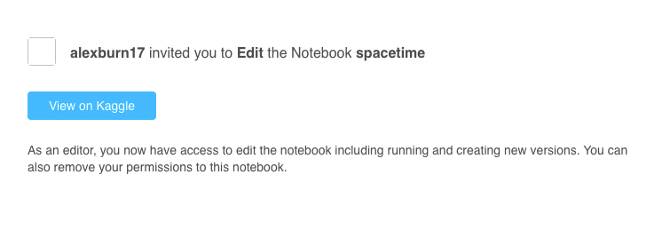
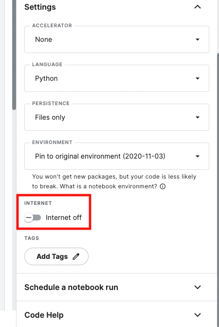
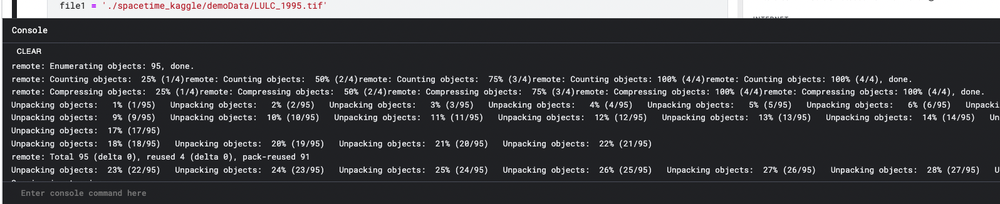
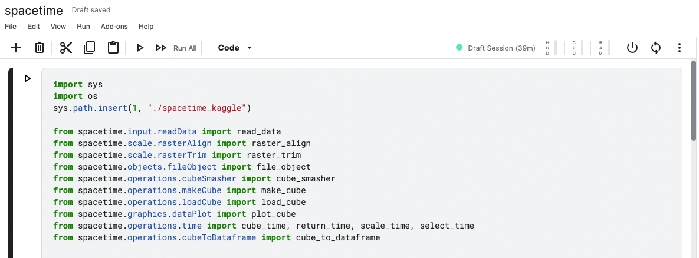

## Using spacetime in Kaggle


### Step 1: Create an account
First, create a free Kaggle acount. [Create a Kaggle Acount](https://www.kaggle.com/)

In order to access features like an internet connection for linking to a github repository and uploading and downloading data sets, you will need to phone verify your account. Click on the icon in the top right and select account (The gear icon). Under "phone verification", enter your phone number and then enter the 6 digit code that was sent to your device.

### Step 2: Send me your username
The spacetime repository is private until it is fully developed. Email me your username (alexburn17@gmail.com) and I will give you access.

### Step 3: Access the repository 
You will be sent an email with a link to the repository. Click the blue button to access the kaggle workbook.



### Step 4: Clone the github repo
The Kaggle workbook that you will be brought to will not be linked to the spacetime github repository. First, navigate the the right panel and under settings, switch on the internet connection. The siwtch is show below highlighted in red.  



Then copy and paste the following command in the console at the bottom of the screen. Click the black bar labeled "console" to bring the full console window up.

```
!git clone https://github.com/alexburn17/spacetime_kaggle
```
When you hit return, you should see the following loading screen:



### Step 5: Start using spacetime

The main script can now be edited and the functions listed in the API can now be used. 

The instance of the VM can be turned on and off and restarted if issues arrise by clicking the power button in the upper right. Code can be run block by block using the run bottons on the left.



I recorded a video that shows how to start working in Kaggle below:

[Getting Started with Kaggle on Spacetime](https://youtu.be/eJyzO5nE5Pw)


